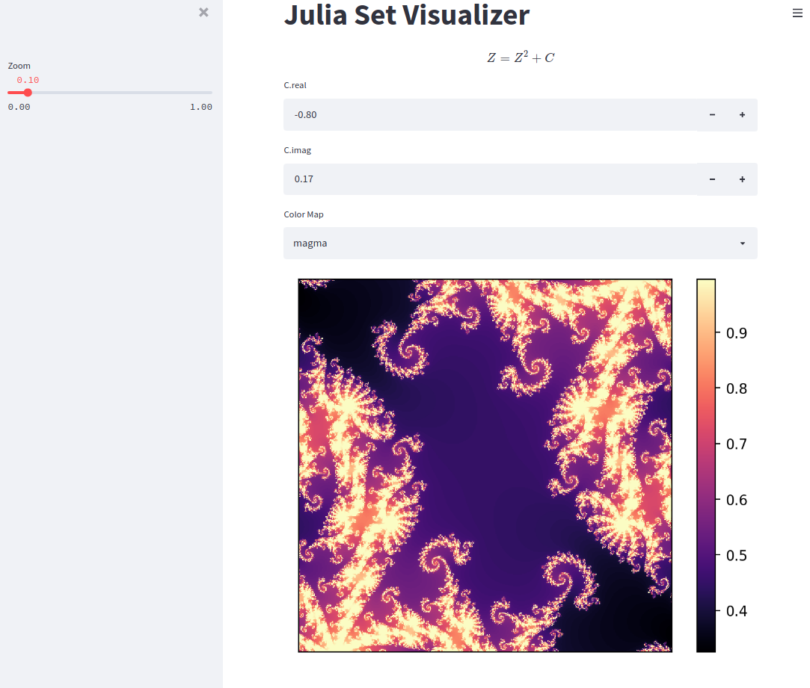

# Quick Visualization App for JuliaSet

This small app is built on top of `streamlit` to provide a interactive view
of standard Julia set.




## How to run

- clone the repo and make a virtual environment for it.
- install the dependencies (both `pip` and `conda` should work).
- navigate to the repo folder, and run

```bash
streamlist run juliasetApp.py
```
